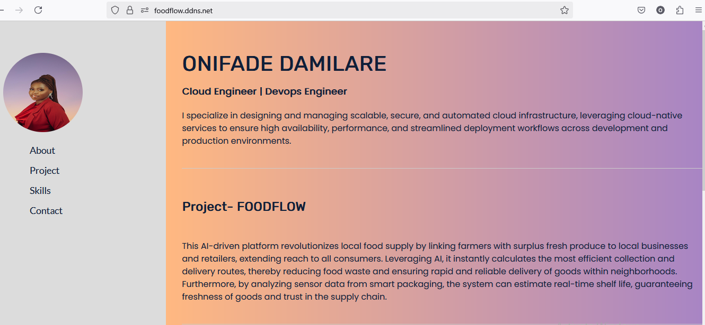

## About my Project
Created a simple portfolio page using HTML and CSS, with Node.js as the backend to test reverse proxying with Nginx. Deployed the setup securely on an Amazon EC2 instance, using HTTPS with Let's Encrypt and custom domain mapping.
## Tech Stack:
- Frontend: HTML, CSS
- Backend: Node.js (Express)
- Web Server: Nginx (reverse proxy)
- Hosting: AWS EC2 (Ubuntu)
- Security: SSL via Let's Encrypt, custom domain
## Steps for deployment
1. Creation of AWS account if you don't have one, navigate to the management console and search for the EC2, then launch an EC2 instance. Use Ubuntu as operating system, configure security groups to allow ssh, http and https.
2. Connect to instance/server using ssh, install nginx as webserver using `sudo apt install nginx`.
3. To get the files for the website, install Git using the `sudo apt install git`. Once Git is installed, create a directory to keep the git project by `mkdir directory-name`. Then use the command `git clone project-ur1` to copy the project files. *Replace project-url with the actual one*.
4. To make the website secure, create a custom domain and the destination should be the instance ip address. Then, install certbot with `sudo apt install certbot`, the plugin using `sudo apt install python3-certbot-nginx`and to create the ssl certicate using `sudo certbot --nginx`.
5. Install Nodejs from the official website, navigate to the project folder(folder that has package.json) then use the command `npm install` to install packages.
6. To make nginx acts as reverse proxy, edit this */etc/nginx/sites-available/default file*. Add *proxy_pass http://localhost:3000;* to the location block in the ssl certificate server block, save the file and run `sudo systemctl reload nginx`. Make sure the file in */var/www/html* is removed so to avoid problems. To redirect instance ip address to domain name, add *return 301 https://yourdomaincom$request_uri;* to your default server block.
7. Go to the project folder and run `nohup node server.js &` to make nodejs run continously in the background even if you log out of the server and the website is up and running!!!.
## Live demo
Access the deployed landing page at: http://3.83.43.207 or foodflow.ddns.net
## Here’s what the page looks like in the browser:

